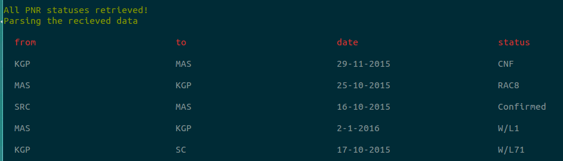
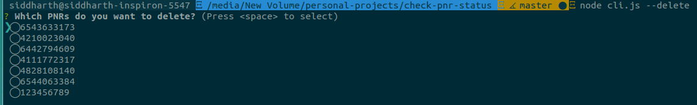

# check-pnr-status

> Keep track of your PNRs, without having to visit irctc.co.in

[](https://travis-ci.org/icyflame/check-pnr-status)

[](https://github.com/Flet/semistandard)



**Compatible with Node <0.12.7 only**

I am working to make this work in latest versions (Node 4.x). Meanwhile, you can use a Node.js version
manager such as [nvm](https://github.com/creationix/nvm) or [n](https://github.com/tj/n).

## Why?

Visiting irctc.co.in and logging in and then checking the status of your PNR
requires close to 10-15 clicks per PNR and involves entering your username
and password. That was simply too much effort for a trivial operation.
Using this module, will let you keep track of your PNRs from
the terminal without any overhead.


## CLI

```
$ npm install --global pnr
```
```
$ pnr --help

  Keep track of your PNRs, without having to visit irctc.co.in

  Usage
    $ pnr [input]

  Examples
    $ pnr
    All PNR statuses retrieved!
    Parsing the recieved data.

   ┌───────────────┬───────────────┬───────────────┬───────────────┐
   │ from          │ to            │ date          │ status        │
   ├───────────────┼───────────────┼───────────────┼───────────────┤
   │ KGP           │ MAS           │ 29-11-2015    │ CNF           │
   ├───────────────┼───────────────┼───────────────┼───────────────┤
   │ SRC           │ MAS           │ 16-10-2015    │ Confirmed     │
   ├───────────────┼───────────────┼───────────────┼───────────────┤
   │ MAS           │ KGP           │ 2-1-2016      │ W/L1          │
   ├───────────────┼───────────────┼───────────────┼───────────────┤
   │ KGP           │ SC            │ 17-10-2015    │ W/L71         │
   └───────────────┴───────────────┴───────────────┴───────────────┘

    $ pnr --add 1234567890

    PNR added! Run pnr -a to check status of all PNRs!

  Options
    --add          Add a PNR
    --delete, -d   Delete a PNR
    --all, -a      Show statuses of all the PNRs stored on machine
```


## Known Limitations

- IRCTC has a daily maintenance shutdown between **2330 and 0030 India Standard Time.** This module and any browser page that checks PNR statuses won't work during this time.
- PNRs that have expired (date is past the travel date will automatically be flushed by IRCTC),
and hence won't show up on your results table. **But I strongly recommend that you delete
the PNR once you have travelled with it.** (Keeping it in memory will take up the time that is required to request details from IRCTC
  as it will also go through the HTML parser and then be omitted.)


## CLI Options

### pnr --options

#### pnr

*No arguments*  
Type: `string`

Show the statuses of all the stored PNRs

#### options

##### add

Type: `string of digits`  

Add a PNR (must be 10-digit string)

##### delete

Delete a PNR (using a selection element)




## TODO

- **_Required_** Fix the tests.js module and make it work!
- **_Required_** Have logger integration with `debug`, `verbose`, `info` levels. Provide functionality to users to run the command with `verbose` option.
- _Medium_ Store the recieved data in a JSON and show it during the maintenance hours of IRCTC.
- _Long term_ Use the JSON to find the expiry date of each PNR and delete PNR from system after the travel date.
- _Always_ Write more tests!


## License

MIT © [Siddharth Kannan](http://icyflame.github.io)
